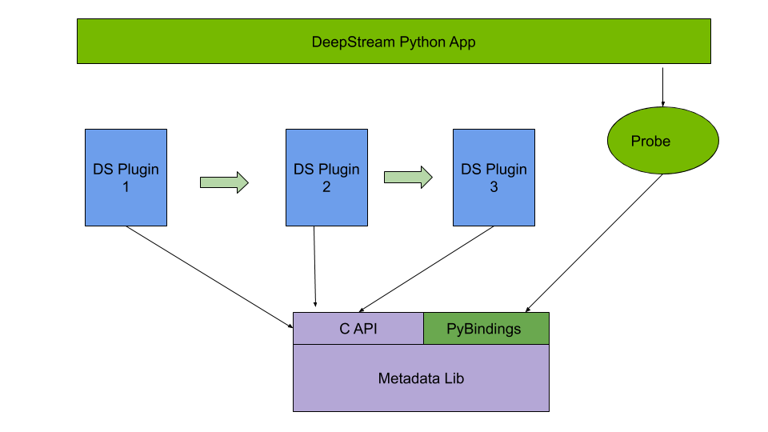
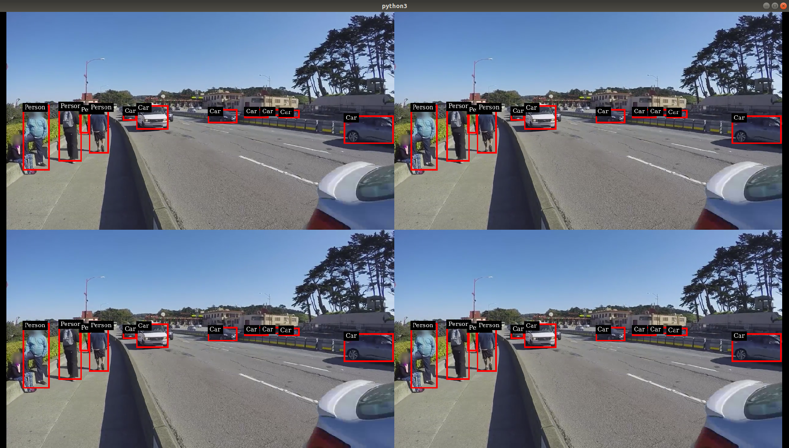

# DeepStream Python Apps

This repository contains Python bindings and sample applications for the [DeepStream SDK](https://developer.nvidia.com/deepstream-sdk).  

SDK version supported: 6.1.1

<b>The bindings sources along with build instructions are now available under [bindings](bindings)!  </b>

<b>This release comes with Operating System upgrades (from Ubuntu 18.04 to Ubuntu 20.04) for DeepStreamSDK 6.1.1 support. This translates to upgrade in Python version to 3.8 and [gst-python](3rdparty/gst-python/) version has also been upgraded to 1.16.2 !</b>

Download the latest release package complete with bindings and sample applications from the [release section](../../releases).  

Please report any issues or bugs on the [DeepStream SDK Forums](https://devtalk.nvidia.com/default/board/209). This enables the DeepStream community to find help at a central location.

- [DeepStream Python Apps](#deepstream-python-apps)
  - [Python Bindings](#python-bindings)
  - [Sample Applications](#sample-applications)

## Python Bindings

DeepStream pipelines can be constructed using Gst Python, the GStreamer framework's Python bindings. For accessing DeepStream MetaData, 
Python [bindings](bindings) are provided as part of this repository. This module is generated using [Pybind11](https://github.com/pybind/pybind11).

These bindings support a Python interface to the MetaData structures and functions. Usage of this interface is documented in the [HOW-TO Guide](HOWTO.md) and demonstrated in the sample applications.  

## Sample Applications

Sample applications provided here demonstrate how to work with DeepStream pipelines using Python.  
The sample applications require [MetaData Bindings](#metadata_bindings) to work.  

To run the sample applications or write your own, please consult the [HOW-TO Guide](HOWTO.md)  

We currently provide the following sample applications:
* [deepstream-test1](apps/deepstream-test1) -- 4-class object detection pipeline
* [deepstream-test2](apps/deepstream-test2) -- 4-class object detection, tracking and attribute classification pipeline
* [deepstream-test3](apps/deepstream-test3) -- multi-stream pipeline performing 4-class object detection - now also supports triton inference server, no-display mode, file-loop and silent mode
* [deepstream-test4](apps/deepstream-test4) -- msgbroker for sending analytics results to the cloud
* [deepstream-imagedata-multistream](apps/deepstream-imagedata-multistream) -- multi-stream pipeline with access to image buffers
* [deepstream-ssd-parser](apps/deepstream-ssd-parser) -- SSD model inference via Triton server with output parsing in Python
* [deepstream-test1-usbcam](apps/deepstream-test1-usbcam) -- deepstream-test1 pipelien with USB camera input
* [deepstream-test1-rtsp-out](apps/deepstream-test1-rtsp-out) -- deepstream-test1 pipeline with RTSP output
* [deepstream-opticalflow](apps/deepstream-opticalflow) -- optical flow and visualization pipeline with flow vectors returned in NumPy array
* [deepstream-segmentation](apps/deepstream-segmentation) -- segmentation and visualization pipeline with segmentation mask returned in NumPy array
* [deepstream-nvdsanalytics](apps/deepstream-nvdsanalytics) -- multistream pipeline with analytics plugin
* [runtime_source_add_delete](apps/runtime_source_add_delete) -- add/delete source streams at runtime
* [deepstream-imagedata-multistream-redaction](apps/deepstream-imagedata-multistream-redaction) -- multi-stream pipeline with face detection and redaction
* [deepstream-rtsp-in-rtsp-out](apps/deepstream-rtsp-in-rtsp-out) -- multi-stream pipeline with RTSP input/output
* [deepstream-preprocess-test](apps/deepstream-preprocess-test) -- multi-stream pipeline using nvdspreprocess plugin with custom ROIs
* <b>NEW</b> [deepstream-demux-multi-in-multi-out](apps/deepstream-demux-multi-in-multi-out) -- multi-stream pipeline using nvstreamdemux plugin to generated separate buffer outputs

Detailed application information is provided in each application's subdirectory under [apps](apps).  

